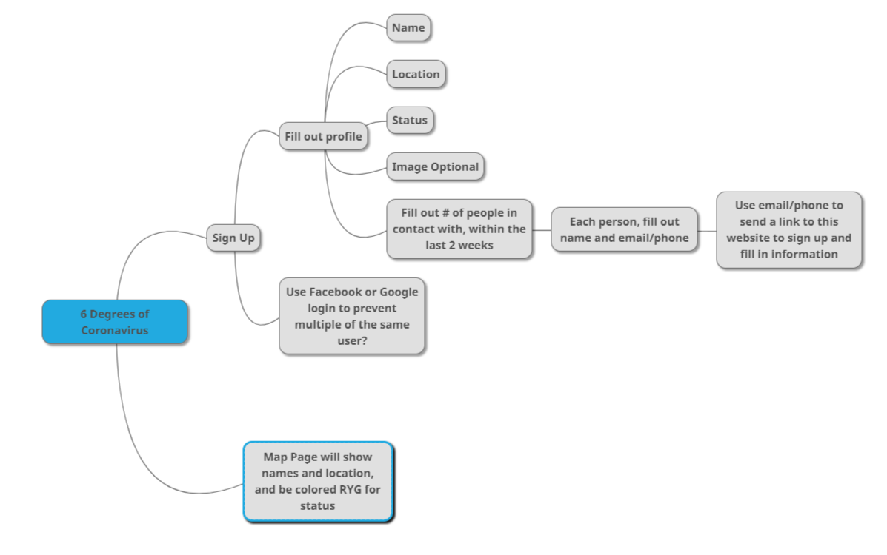

# 6-Degrees-of-Coronavirus

Watch the progress [here.](https://six-degrees-of-coronavirus.herokuapp.com/)

You log in, note your status, and mark the people you've had contact with in the past 2 weeks. 

### Status Options: 
* Uninfected (green)
* Presumptive Positive (yellow)
* Positive (red)

If you know their email or phone, you can send them an invite to make their profile and set their status, and then put down the people THEY had in contact with. 

The site will do this zoom-out animation from your name/face to your contacts, then their contacts, etc.

### Technologies

* MERN Stack
* [Scroll Reveal](https://github.com/jlmakes/scrollreveal)-- To reveal other users as you move around the degree map

#### Contributors

Crystal Ly
Anthony Garza